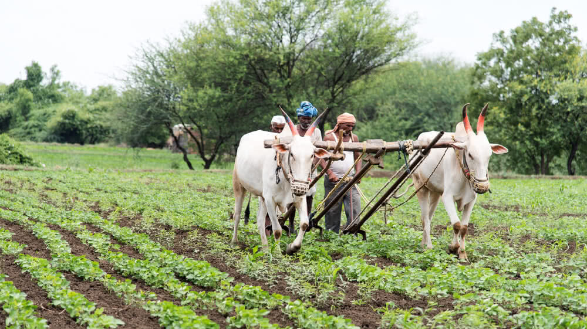
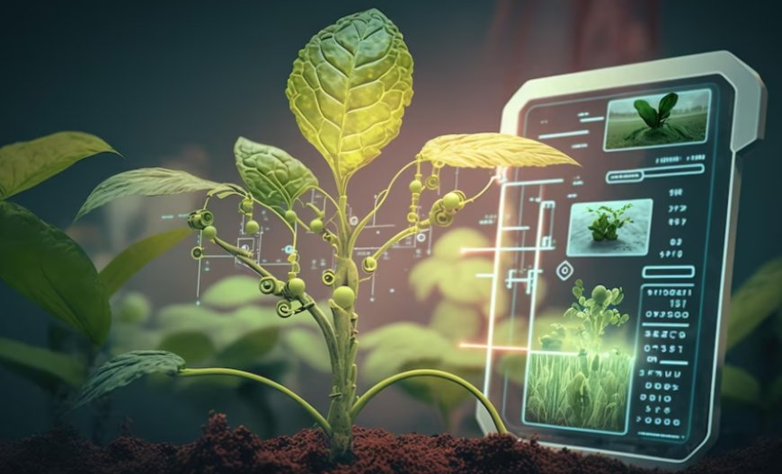
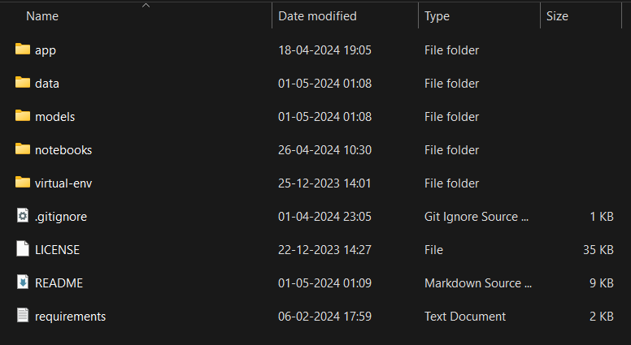
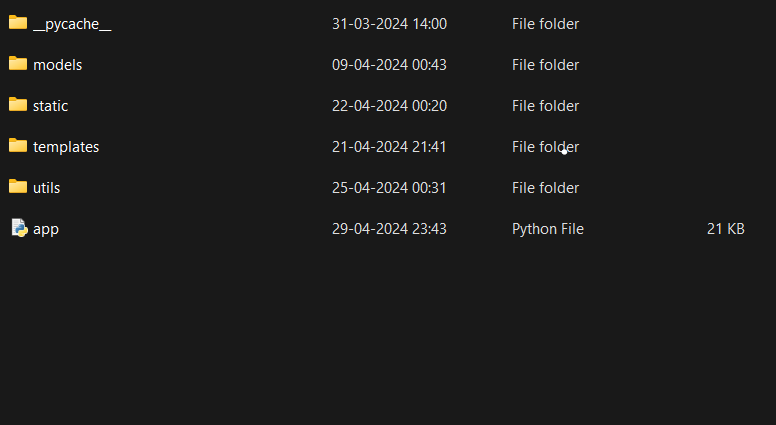
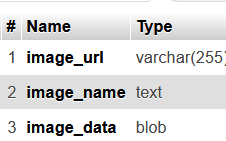
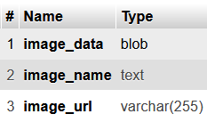
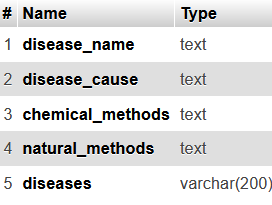

<h1 align = center style="color:green;"> <span style="color:green;">AGRI INNOVATIVE </h1>


   

<div style = " margin-top: 30px;text-align : center">


[](https://github.com/usmanbvp/agri-innovative/blob/main/LICENSE)


</div>

## 📝 Description
- In India, where the livelihoods of millions depend on agriculture, embracing cutting-edge computer science technologies is essential for fostering sustainable growth and prosperity. Our mission is straightforward yet significant: to increase farmer's profitability while streamlining farming processes through innovative software solutions.

- At the core of our initiative lies the recognition of agriculture's fundamental role in driving economic advancement. By leveraging the latest developments in computer science, particularly in areas like Machine Learning and Deep Learning, we strive to revolutionize age-old farming practices.


## 🗂️Project Structure

The project is organized into the following directories and files:

- [app](app/): This folder contains all the static files,templates and backend code written in python (flask) that through which we have converted the raw code and  models into a meaning full project. 
- [Static](app/static/): This folder includes static files used in the project, such as images, stylesheets and scripts.
- [images](app/static/images/): This folder contains all the relevant images used in this project, such as those used in document preparation, presentation materials, and visual aids to enhance understanding.
- [Templates](app/templates/): The templates folder contains HTML templates used for rendering web pages.
- [app.py](app/app.py): This is the main application file that runs the project's web application.
- [Data](data/): The data folder contains the data used in this project.
- [Notebooks](notebooks/): This folder contains Jupyter notebooks with code covering data exploration, model building, and evaluation.
- [Models](models/): This folder houses a collection of trained machine  learning models.
- [Requirements](requirements.txt): This requirements text file contains all the required dependencies that we need to install to run the project.


The structure of project files will look like this :

<div style="display: flex; justify-content: space-between; align-items: flex-start;">
    <div style="flex: 1; text-align: center;">
        <p><b>Project Structure </b></p>
        
    </div>
    <div style="flex: 1; text-align: center;">
        <p><b>App Structure</b></p>
        
    </div>
</div>

## 👨🏻‍💻Technologies Used 
 <ul>
 <li> <b>Front End: </b>   HTML, CSS, Java Script</li>
 <li> <b> Back End: </b>  Flask </li>
<li> <b> Python Libraries : </b>  Numpy, Pandas, Matplotlib, Seaborn </li>
<li> <b> ML and DL Libraries : </b>  Scikit-Learn, TensorFlow </li>
<li><b> Database:</b> 
MySQL </li>
 </ul>

## ⏳ Dataset 

In this project to train the machine learning and Deep Learning models we have taken datasets from [Kaggle](https://www.kaggle.com/). 

### 1.Fertilizer Recommendation Dataset
This dataset contains essential parameters for fertilizer recommendation models, aiding in the optimization of crop yield and soil health. The dataset includes the following fields:

    N: Ratio of Nitrogen content in soil

    P: Ratio of Phosphorous content in soil

    K: Ratio of Potassium content in soil

    Temperature: Temperature in degrees Celsius

    Humidity: Relative humidity in percentage

    Moisture: Moisture level in percentage

    Crop Type: Name of the crop

    Soil Type: Type of the soil

 Download the fertilizer Recommendation dataset for  custom training <a href="https://github.com/usmanbvp/agri-innovative/blob/main/data/raw/fertilizer_recommendation.csv">here</a>

### 2.Crop  Recommendation Dataset
This dataset serves as a valuable resource for crop recommendation systems, aiding in the selection of optimal crops based on various soil and environmental factors. The dataset comprises the following essential fields:

    N: Ratio of Nitrogen content in soil
    
    P: Ratio of Phosphorous content in soil

    K: Ratio of Potassium content in soil

    Temperature: Temperature in degrees Celsius

    Humidity: Relative humidity in percentage

    pH: pH value of the soil

    Rainfall: Rainfall in millimeters

Download the Crop Recommendation dataset for custom training <a href="https://github.com/usmanbvp/agri-innovative/blob/main/data/raw/crop_recommendation.csv">here</a>

 ### 3.Disease Identification Dataset
This dataset is recreated using offline augmentation from the original dataset. This dataset consists of about 87K rgb images of healthy and diseased crop leaves which is categorized into 38 different classes. The total dataset is divided into 80/20 ratio of training and validation set preserving the directory structure. A directory containing 33 test images is created for prediction purpose.

Download the Disease Identification dataset for custom training <a href="https://www.kaggle.com/datasets/vipoooool/new-plant-diseases-dataset">here</a>


## 📒Notebooks
- <a href="https://github.com/usmanbvp/agri-innovative/blob/main/notebooks/fertilizer_recommendation.ipynb"> Fertilizer Recommendation </a>
- <a href="https://github.com/usmanbvp/agri-innovative/blob/main/notebooks/crop_recommendation.ipynb"> Crop Recommendation </a>
- <a href="https://github.com/usmanbvp/agri-innovative/blob/main/notebooks/plant_disease_identification.ipynb"> Disease Identification </a>

## 🛠️How to Install and Run this Project?

To get started with the project, follow these steps:

1. Clone this repository to your local machine:

```
git clone https://github.com/usmanbvp/agri-innovative.git
```
2. Install the project dependencies by running the following command:
```
pip install -r requirements.txt
```

3. Explore the project's directories and files to become familiar with its structure.


4. Create database `agritest` by visiting this url <a href = "https://localhost/phpmyadmin/"> https://localhost/phpmyadmin/</a>

 Then  in that database create three tables with the following details to store  fertilizer recommendation, crop recommendation and disease_identification results related info.

<div style="display: flex; justify-content: space-between;">
    <div style="text-align: center;">
        
        <p>fertilizer_images</p>
    </div>
    <div style="text-align: center;">
        
        <p>crop_images</p>
    </div>
    <div style="text-align: center;">
        
        <p>disease_details</p>
    </div>
</div>

After that,run the following code to upload the results related info into those tables:

<b>fertilizer_images</b>: [run_this_code](app/utils/fertilizer_image_upload.py)

<b>crop_images</b>: [run_this_code](app/utils/crop_image_upload.py)

<b>disease_details</b>: [run_this_code](app/utils/uploadexcel.py)

5. Finally execute the following command to run the project locally:
```
python app.py
```
6.After executing app.py, access the provided localhost URL to utilize the project directly in your web browser on your local machine.
```
http://127.0.0.1:5000/

```

## ▶️Demo of the Project
The AgriInnovative project website mainly consists of six pages. They are
<ul>
<li> Home</li>
<li> Dashboard</li>
<li> Services</li>
<li> News</li>
<li>Connect </li>
<li> Login and SignUp</li>
</ul>

Let's see the demo of the project.


## 📄 License

This project is licensed under the GPL License - see the [LICENSE](LICENSE) file for details.

## 📝Feedback and Support
If you have any feedback, suggestions, or questions regarding the project, please create an issue in the repository or contact me at usman.bvp@gmail.com. or [LinkedIn](https://www.linkedin.com/in/usmanbvp/)